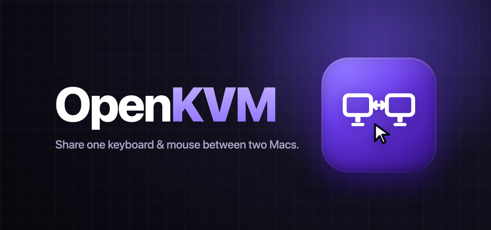

# OpenKVM



[](https://github.com/mukulchugh/OpenKVM/releases/latest)
[](#requirements)
[](LICENSE)

macOS menu bar app that forwards a physical keyboard and mouse from one Mac to another over the local network.

The Mac with the hardware attached captures keystrokes and pointer events, sends them to your other Mac over TCP/UDP, and replays them there. Toggle control with **⌘⇧K** or the menu bar — the hotkey always works locally so you are never locked out.

It works across different Apple IDs (a work Mac + a personal Mac), doesn't depend on Handoff or iCloud, and gives you an explicit hotkey instead of edge-scroll — just a plain TCP/UDP connection over Bonjour with its own pairing token.

## Requirements

- macOS 13+
- Xcode Command Line Tools (`swift`, `xcodebuild`)
- Both Macs on the same local network (or reachable by IP)
- OpenKVM installed and running on **both** Macs

## Quick start

1. Build or install OpenKVM on both Macs (see [Install](#install)).
2. On the Mac **with the keyboard**, open **Settings** and enable **This Mac has the physical keyboard**.
3. On either Mac, open **Settings → Other Mac** and click **Pair** next to the discovered peer. Approve the dialog on the other Mac.
4. Grant **Accessibility**, **Input Monitoring**, and **Local Network** when prompted.
5. Press **⌘⇧K** (or use the menu) to forward the keyboard to the other Mac. Press again to bring it back.

## Build

```bash
./build-app.sh
```

Output: `dist/OpenKVM.app` (universal arm64 + x86_64)

For a stable code signature so Accessibility permission survives rebuilds:

```bash
./scripts/make-signing-cert.sh   # once per Mac
./build-app.sh
```

### DMG installer

```bash
chmod +x build-dmg.sh
./build-dmg.sh
```

Output:

- `dist/OpenKVM.zip` — **preferred for your other Mac** (avoids false "damaged" errors)
- `dist/OpenKVM.dmg` — drag-to-Applications installer

## Install

### Other Mac says DMG is "damaged"?

macOS shows that for unsigned apps — the file is not actually corrupted. Use the ZIP instead:

```bash
# On the other Mac, after copying OpenKVM.zip over:
unzip OpenKVM.zip
chmod +x install-on-mac.sh
./install-on-mac.sh
```

Then right-click **OpenKVM → Open** in Applications (first launch only).

If you still want the DMG:

```bash
xattr -cr ~/Downloads/OpenKVM.dmg
open ~/Downloads/OpenKVM.dmg
```

### From DMG (this Mac)

Open `dist/OpenKVM.dmg`, drag OpenKVM to Applications.

### From app bundle

```bash
cp -R dist/OpenKVM.app /Applications/
```

First launch: right-click → Open (unsigned build). Grant **Accessibility**, **Input Monitoring**, **Post Event** (on the receiver), and **Local Network** permissions.

## Setup (both Macs)

| Mac | Settings |
|-----|----------|
| **Owner** (has keyboard) | Enable "This Mac has the physical keyboard" |
| **Receiver** (other Mac) | Leave that toggle **off** |

Pairing (automatic):

1. Open **Settings** on either Mac.
2. Wait for the other Mac to appear under **Other Mac**.
3. Click **Pair**, then click **Approve** on the other Mac.

Manual (if Bonjour discovery fails): open **Advanced**, set the other Mac's IP and ensure both Macs share the same pairing token.

Use **Test connection** (Advanced) to verify reachability.

## Usage

| Action | How |
|--------|-----|
| Forward keyboard & mouse to other Mac | Menu bar → "Switch keyboard to other Mac", or **⌘⇧K** |
| Bring keyboard back to this Mac | Menu bar → "Switch keyboard back to this Mac", or **⌘⇧K** |
| Open settings | Menu bar → Settings…, or **⌘,** |
| Recover stale permissions / network | Menu bar → Refresh, or **⌘R** |

## Architecture

| Component | Role |
|-----------|------|
| **HIDInputCapture** | IOKit HID Manager capture from one specific external keyboard + mouse (never the built-in trackpad/keyboard) |
| **InputBridge** | Orchestrates capture/injection, hotkey, media keys, CGEvent replay on the receiver |
| **PeerNetwork** | TCP (keys/buttons) + UDP (mouse move/scroll) listener, Bonjour discovery (`_openkvm._tcp`), wire protocol |
| **ConfigStore** | Persists pairing token, peer, owner flag in UserDefaults |
| **SettingsView** | SwiftUI settings: pairing, permissions, diagnostics |

Default TCP port: **9847**. Messages are length-prefixed JSON.

For the full technical reference — data flows, wire protocol, TCC permissions, build pipeline, and debugging — see **[ARCHITECTURE.md](ARCHITECTURE.md)**.

## Development

```bash
# Run from source (debug)
swift run

# Test peer connectivity (app must be running)
python3 scripts/test-peer-ping.py 127.0.0.1 9847 <your-token>
python3 scripts/test-peer-setup.py 127.0.0.1 9847 <your-token>
```

## Project structure

```
Sources/OpenKVM/     Application source (7 Swift files)
Resources/             Info.plist, app icon
scripts/               Installer, signing cert, test clients
build-app.sh           Universal .app packaging
build-dmg.sh           DMG + ZIP distribution
```

## Known issues & good first issues

New here? These are scoped, self-contained, and a good place to start — the wire protocol is small and documented in [ARCHITECTURE.md](ARCHITECTURE.md).

- **[Windows ↔ Mac support](https://github.com/mukulchugh/OpenKVM/issues/1)** — a Windows client that speaks the existing protocol and injects events via `SendInput`.
- **[Linux ↔ Mac support](https://github.com/mukulchugh/OpenKVM/issues/2)** — a Linux client injecting events via `uinput`/evdev.
- **[Mouse jitter during fast movement](https://github.com/mukulchugh/OpenKVM/issues/3)** — sequence UDP mouse packets and coalesce deltas on the receiver.

See all [good first issues](https://github.com/mukulchugh/OpenKVM/labels/good%20first%20issue).

## Contributing

Contributions are welcome — bug fixes, new platform clients, and docs.

1. Fork and clone the repo.
2. Build and run from source: `swift run` (see [Development](#development)).
3. Create a branch: `git checkout -b my-change`.
4. Make your change. Keep the diff focused; match the surrounding style.
5. Test against a real second machine, or with `scripts/test-peer-ping.py` / `scripts/test-peer-setup.py`.
6. Commit, push, and open a pull request describing what changed and how you verified it.

For anything non-trivial, open an issue first so we can agree on the approach. The [architecture reference](ARCHITECTURE.md) explains the data flows, wire protocol, and permission model.